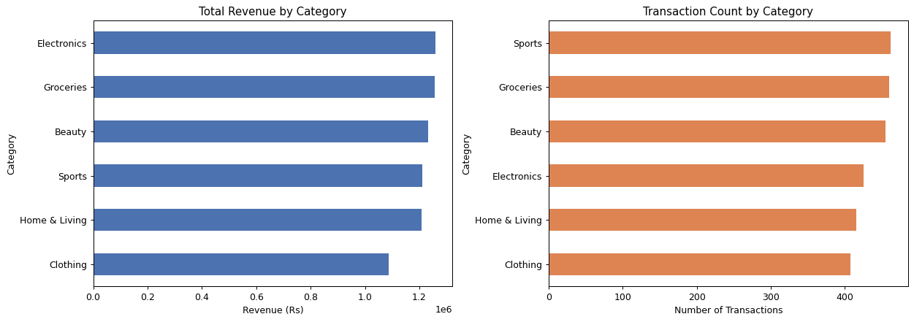
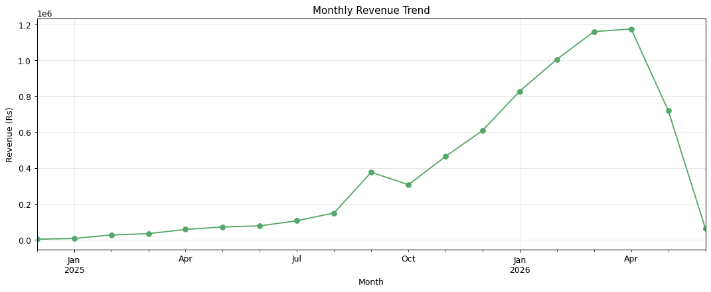
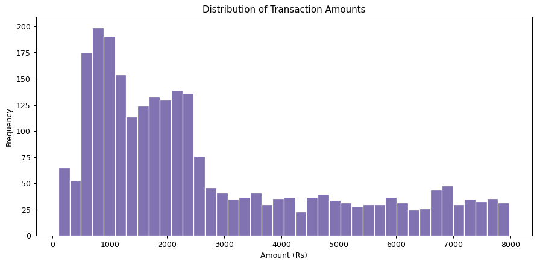
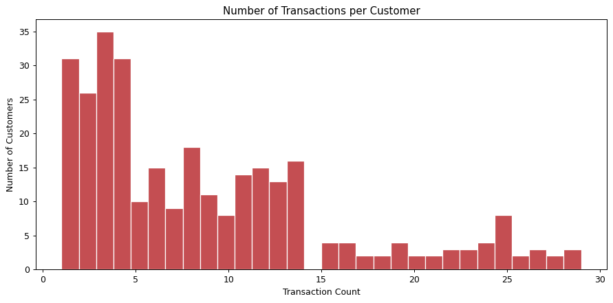
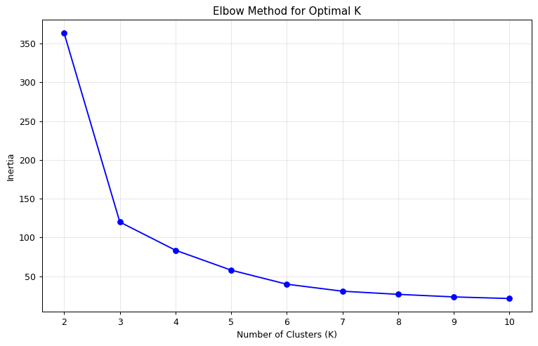
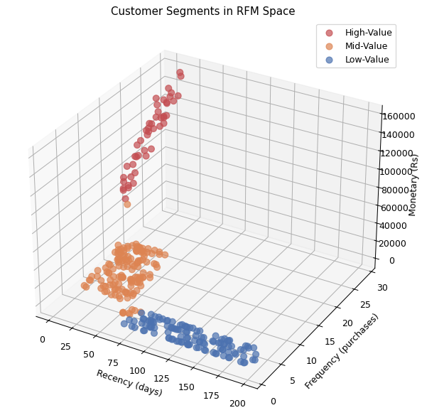
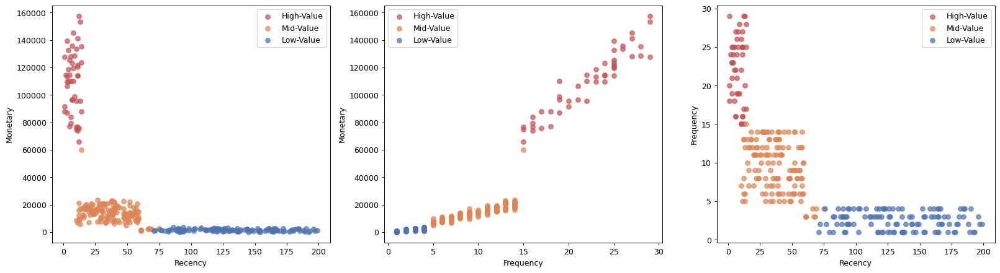

# CloudExify Data Science — Month 1 Final Project
## Customer Segmentation Analysis

**Internship:** CloudExify Summer Internship 2026
**Track:** Data Science — Month 1, Project 2 (Final Submission)
**Tools:** Python, Jupyter Notebook, pandas, NumPy, matplotlib, scikit-learn

---

## 📁 Repository Contents

| File | Description |
|---|---|
| `sales_analysis.ipynb` | Data loading, cleaning, exploratory analysis, and sales trend visualization |
| `customer_segmentation.ipynb` | RFM analysis + K-Means clustering for customer segmentation |
| `sample_data/customer_transactions.csv` | Sample transaction dataset (300 customers, 2,624 transactions) |
| `sample_data/customer_segments_output.csv` | Final output: each customer with RFM scores and assigned segment |
| `README.md` | This file |

---

## 📊 Dataset

A synthetic but realistic transaction dataset was generated for this project, since no
live sales data was available. It simulates:

- **300 unique customers**
- **2,624 transactions** between Dec 2024 and Jun 2026
- Fields: `TransactionID`, `CustomerID`, `Date`, `Amount`, `Category`
- 6 product categories: Electronics, Groceries, Clothing, Home & Living, Beauty, Sports
- Purchase behavior deliberately varied across customers (some frequent/high-spend,
  some rare/low-spend) so that meaningful clusters would emerge — mirroring how a real
  customer base is naturally spread across value tiers.

---

## 🔍 Methodology

### 1. Sales Analysis (`sales_analysis.ipynb`)
- Cleaned and validated the raw transaction data (dates, duplicates, invalid amounts)
- Explored revenue by category, monthly sales trends, transaction value distribution,
  and purchase frequency per customer

### 2. Customer Segmentation (`customer_segmentation.ipynb`)
1. **RFM Calculation** — For each customer: Recency (days since last purchase),
   Frequency (number of transactions), Monetary (total spend)
2. **Normalization** — Scaled RFM features with `StandardScaler` so no single metric
   dominates the distance calculation
3. **Elbow Method** — Tested K = 2 through 10 to find the optimal number of clusters;
   K = 3 was selected
4. **K-Means Clustering** — Applied `KMeans(n_clusters=3)` and mapped clusters to
   business-friendly names based on average spend
5. **Segment Profiling** — Computed average R/F/M per segment and segment sizes
6. **Visualization** — 3D scatter plot (Recency × Frequency × Monetary) plus 2D pairwise
   views for clarity

---

## 📊 Visualizations

### Sales Analysis

**Revenue & Transaction Count by Category**


**Monthly Revenue Trend**


**Distribution of Transaction Amounts**


**Transactions per Customer**


### Customer Segmentation

**Elbow Method (Optimal K = 3)**


**Customer Segments — 3D View (Recency × Frequency × Monetary)**


**Customer Segments — 2D Pairwise Views**


---

## 📈 Key Findings

| Segment | Customers | Avg. Recency (days) | Avg. Frequency | Avg. Monetary (Rs) |
|---|---|---|---|---|
| **High-Value** | 47 (15.7%) | ~8 | ~22 | ~109,656 |
| **Mid-Value** | 138 (46.0%) | ~37 | ~9 | ~13,872 |
| **Low-Value** | 115 (38.3%) | ~134 | ~2.5 | ~1,597 |

*(Exact figures are in the notebook outputs; values will shift slightly if the
underlying data is regenerated with a different random seed.)*

**Insights:**
- A small High-Value segment (~16% of customers) drives a disproportionate share of
  revenue — these are recent, frequent, high-spending customers.
- The Mid-Value segment is the largest group and represents the biggest growth
  opportunity: they buy semi-regularly but haven't reached High-Value spending levels.
- The Low-Value segment has long gaps since their last purchase and very few total
  transactions — a strong churn risk without intervention.

---

## 💡 Business Recommendations

| Segment | Recommended Action |
|---|---|
| **High-Value** | VIP treatment — exclusive offers, priority service, loyalty rewards to protect this high-margin group |
| **Mid-Value** | Targeted upsell campaigns and loyalty programs to grow spend and frequency toward High-Value behavior |
| **Low-Value** | Win-back campaigns — discounts, re-engagement emails, and incentives to prevent full churn |

---

## ✅ Testing Checklist

- [x] Transaction data loaded and cleaned
- [x] RFM scores calculated correctly
- [x] Data normalized with `StandardScaler`
- [x] Elbow method run for K = 2 to 10
- [x] K-Means clustering applied with K = 3
- [x] Segment profiles and sizes generated
- [x] 3D (and 2D) visualizations produced
- [x] Final business report generated

---

## 🚀 How to Run

```bash
pip install pandas numpy matplotlib scikit-learn jupyter
jupyter notebook sales_analysis.ipynb
jupyter notebook customer_segmentation.ipynb
```

Run all cells top to bottom in each notebook. `customer_segmentation.ipynb` reads from
`sample_data/customer_transactions.csv` and writes the final segmented table to
`sample_data/customer_segments_output.csv`.

---

*CloudExify Summer Internship 2026 — Data Science Month 1 Final Submission*
